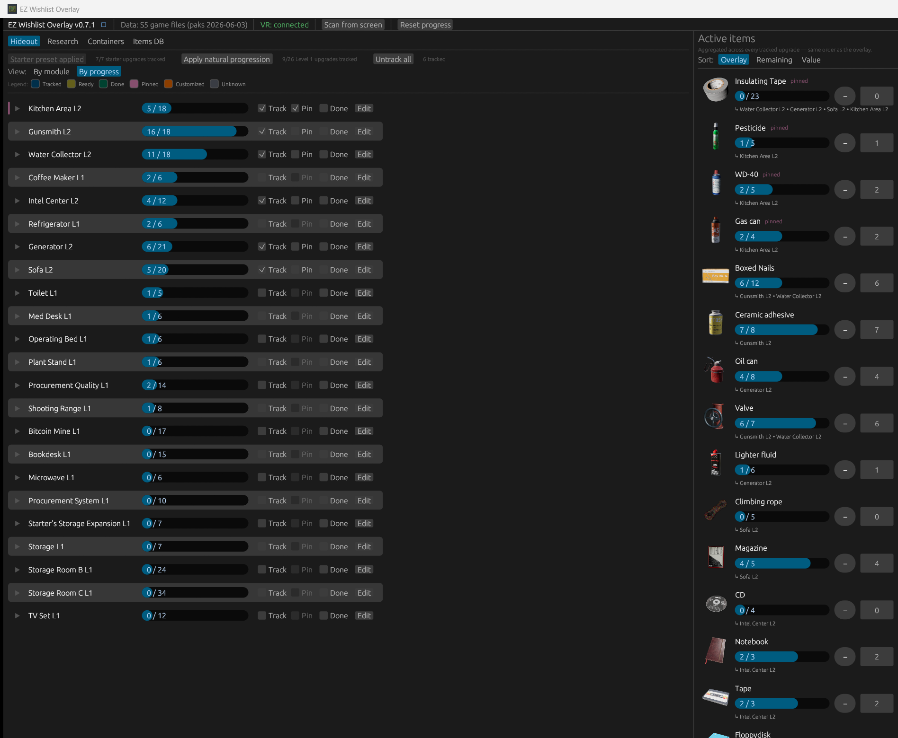
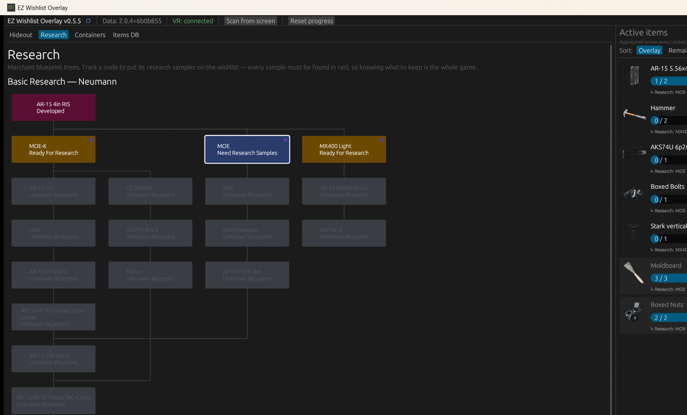
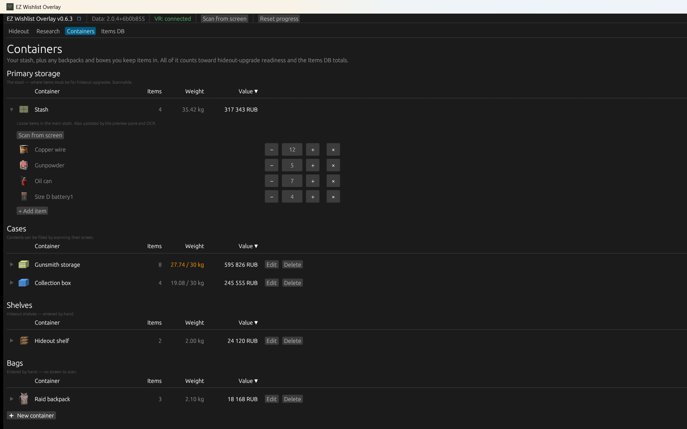

  

<h1 align="center">EZ Wishlist Overlay</h1>

  A free desktop + SteamVR companion for <strong>Contractors Showdown: ExfilZone</strong>. 
  Pick the hideout upgrades and research blueprints you're working toward, and it builds one 
  combined shopping list of every item you still need — on your monitor <em>and</em> floating in VR. 
  Peek at an upgrade panel or storage screen in-game and it reads your progress straight off the screen.

  

  
  
  

> [!NOTE]
> **Anti-cheat-safe by design.** The app never touches the game — no reading its memory, files, or network, no injecting, no hooks. It only talks to SteamVR through the public OpenVR API (the same one OVR Toolkit and XSOverlay use). Even the screenshot feature reads SteamVR's own rendered image, not the game. [More on how this works ↓](#-how-it-stays-anti-cheat-safe)

---

## Why you'd want it

ExfilZone's hideout upgrades each ask for a pile of specific barter items — and the gunsmith's research tree wants raid-found gun parts and tools on top. When you're saving for more than a couple of goals at once, it's hard to remember *what* to pick up and *how many* — so you either over-loot junk or extract without the one thing you needed.

EZ Wishlist Overlay keeps that list for you:

- **Pick your goals** — check off the hideout upgrades and research blueprints you're chasing.
- **Get one combined list** — every required item, de-duplicated and summed across all of them, with a `have / need` count.
- **Check it anywhere** — on your desktop while planning, or floating above you in VR while you loot.
- **Stop counting by hand** — point the app at an upgrade panel or a storage screen in-game and it reads the counts off the screen and fills them in.
- **Keep the gun-parts storage under its cap** — scan the gunsmith's 30 kg storage and see exactly what's inside, what it weighs, and how close you are to the limit.

---

## Features

### 🧾 One combined wishlist

The preview pane on the right is the heart of it: every item across all the upgrades and research nodes you're tracking, summed together, shown as `collected / needed` with a progress bar and the list of goals asking for it. Nudge counts up and down with the `+ / −` buttons, or type an exact number to seed it from what's already in your stash. Pinned upgrades and research nodes push their items to the front here and in the headset, and a **Sort** switch can reorder this desktop list by what's most remaining or most valuable — the VR overlay keeps its own steady order so it never reshuffles mid-raid.

### 📸 Read your progress off the screen — one trigger pull

This is the time-saver, and you never have to take the headset off for it. Hit **Scan from screen** — in the top bar for an upgrade panel, or next to the stash / gun-parts storage / a case in the **Containers** tab — and the wishlist overlay steps aside for a **capture frame** floating in front of you. Line that frame up over the in-game screen and **pull the controller trigger**: the app captures what SteamVR is showing, recognizes the screen, reads the owned-count for every item, and writes those numbers straight into your wishlist — no manual counting. A card pops up in the headset showing exactly what changed, and you can keep scanning screen after screen without leaving VR. (For an upgrade panel it also auto-tracks that upgrade and marks the lower levels done, by default.)

Rather stay at the desk? With the app window focused, press **SPACE** to grab a one-shot upgrade-panel read instead — handy while you're looking at the monitor, or to fire off a quick capture before you put the headset back on.

The same screen-reading covers **three** kinds of in-game screen: the **Facility Upgrade** panel (it reads the owned-count per required item); your **container contents** screens — main stash and item cases (the "box" scan); and the gunsmith's **gun-parts storage**. The scrolling screens (stash, containers, gun-parts storage) capture row-by-row and merge the shots into one contents list — see **Track items across your containers** below — while an upgrade panel reads in a single shot.

  

> It reads SteamVR's *rendered image* — the same pixels already on your headset display — through OpenVR's public mirror-texture API. It never looks at the game process. See [below](#-how-it-stays-anti-cheat-safe).

### 🥽 Glance at your list in VR

Put the headset on and **look up** — the wishlist fades in above you as a SteamVR overlay. It anchors in world space at the spot you raised your gaze to, so you can look back down to read and interact with it without it chasing your eyes. Items grey out as you complete them, and the panel re-renders the instant anything changes on the desktop side.

  

### 👆 Tick items off without taking the headset off

Point a controller at an item in the overlay and pull the trigger to bump its collected count (+1 per click, wrapping back to 0 once you hit the target so you can fix an overshoot). A short haptic pulse confirms each tap.

### 🏠 Track hideout upgrades

The **Hideout** tab lists every facility module, grouped the way the in-game Facility Upgrade screen groups them (Kitchen, Medical, Storage Zone, Lounge…), with a cell per upgrade level. Tick **Track** on the levels you're saving for, or **Done** on ones you've finished. One-click **presets** — a community *Starter* set and a *Natural progression* set, each with a "how many you already have" counter — track a whole recommended batch at once, and *Untrack all* clears your tracking in one go. Flip to the **By progress** view for a ranked to-do list: upgrades you can claim right now rise to the top, ones you're only an item or two short of sit right below, and you can **Pin** the goals you care about most to keep them first.

  

  

### 🔬 Track merchant research

Neumann's **RESEARCH** pad gates weapon-attachment blueprints behind a tree of research nodes, each demanding a handful of sample items — gun parts and tools, every one **found in raid**. The **Research** tab mirrors that tree, using the game's own state labels (*Unknown Blueprint*, *Ready For Research*, *Developed*) so it reads like the in-game pad. Click a node to see what it unlocks and which samples it needs with live `have / need` counts, then use the same **Track → Pin → Done** controls as the hideout: **Track samples** folds them into your combined wishlist, **Pin** pushes a tracked node's samples to the front of the overlay, and marking it **Developed** (keeping or consuming the samples) records your progress. Chasing a specific attachment deep in the tree? **Focus this blueprint** tracks *and* pins it together with every prerequisite still standing in the way — so the whole route's samples lead your wishlist in one click.

  

### 🗃️ Track items across your containers

Your barter items aren't all in one place — some sit in your main stash, others in item cases, on hideout shelves, or in a backpack. The **Containers** tab lets you model that. Your **stash** and the gunsmith's **gun-parts storage** are pinned at the top as primary storage — the game gives you exactly one of each — and below them you can add secondary containers grouped by type — **Cases**, **Shelves**, and **Bags** — each with a name and an icon. Every container's contents count toward your owned totals exactly like the stash, so stashing three bolts in a case and four in your stash still flips an upgrade that needs seven to *ready*.

For storage with an in-game contents screen — your **stash**, the gunsmith's **gun-parts storage**, and the **Cases** — you don't have to type it all in: scan it straight off the screen, exactly as described in **Read your progress off the screen** above. Scanning a container ends in a **Finish & review** step — a before/after diff of new, changed, and removed items, with any mis-read row droppable — and then **replaces** that container's contents with what was read. (The gunsmith storage shows *short* part names that differ from the catalog's full names — the scanner bridges that automatically, so `AR-308 DMR` on the grid still lands on the right catalog part.)

Containers can also carry a **weight cap**, and the built-in **Gunsmith storage** is the reason: the gunsmith's Storage terminal — where your raid-found gun parts pile up — holds **30 kg**, can't be sorted, and the in-game screen never totals what's inside. It ships pinned under Primary storage with the cap already set: scan its screen and the table answers everything at a glance — what's in there, what it's worth, and `27.74 / 30 kg` against the cap, turning **amber** as you close in on it and **red** if your recorded counts ever drift past it. The catalog knows the real weight of nearly every gun part (and every barter item), so the sum is the game's own math. Your own Cases can carry a cap too via *Max weight* in the create/edit dialog — the junk-box Collection Cases also hold 30 kg.

  

### 📦 Items database & stash value

The **Items DB** tab is a sortable, filterable catalog of the game's barter goods — the MISC loot items (gun parts are tracked separately, in the gun-parts storage). Because the *quantity* column is the same count the rest of the app tracks, sorting by **Total Value** turns it into a quick "what's my stash actually worth" view. A **Container** picker scopes the list to one storage location, **Tracked only** narrows it to items you currently need, and **Redundant only** flips it around: items you own more of than your upcoming upgrades can use — your sell pile.

  

### ⚙️ Tune it to your setup

A **Settings** dialog covers the things worth adjusting: Dark / Light / System theme with two colorblind-friendly accent palettes (Okabe-Ito and IBM), the VR overlay's size, grid shape, item cap, and how far up you have to look before it appears, and the capture options — which eye and which controller's trigger, the in-headset capture guide box, the in-headset feedback style (marks on the items themselves — the default — a text card, a mini-grid, or off) and how long it lingers, auto-track on/off, and a debug-artifacts toggle for bug reports. Plus "open data folder" shortcuts. Sensible defaults mean you can ignore all of it if you'd rather.

  

### …and a few niceties

- **Works offline.** All game data is baked into the app — no servers, no accounts. The only network call is an optional once-per-launch update check, which you can turn off.
- **Tells you when there's an update — and installs it.** A quiet banner appears when a newer release is out; on installed (MSI) builds, **Update now** downloads, verifies, and applies it in place, while portable builds get a download link. Dismiss it and it won't nag until the *next* version.
- **Help fix the data.** If an upgrade's recipe is wrong, edit it locally and hit **Export corrections** to get a ready-to-paste GitHub issue so the fix can ship to everyone.

---

## Install

1. **Install SteamVR.** It's what the overlay talks to. Get [Steam](https://store.steampowered.com/), then in the Steam client go to *Library → Tools → SteamVR → Install*. (The desktop app runs fine without it — you just won't get the VR overlay or screenshot reading.)
2. **Download the latest release** from the [**Releases page**](https://github.com/etiennechabert/ez-wishlist-overlay/releases/latest). Grab the installer (**`…-installer.msi`**), or the portable build (**`…-portable.exe`**) if you'd rather not install anything — just double-click it.
3. **Click past the SmartScreen warning.** The build isn't code-signed yet, so Windows shows *"Windows protected your PC."* Click **More info → Run anyway**. (This goes away once there's a signing cert — for now the warning is expected, not a virus.)
4. **Run it.** The app opens. Start SteamVR (or put your headset on) and the header flips from *"VR: not running"* to *"VR: connected"* within a few seconds.
5. **In the headset:** look up to bring the overlay in, point a controller at an item and click to bump its count, and hit **Scan from screen** then pull the trigger over an upgrade panel or storage screen to auto-read your progress (or, at the desk with the window focused, press **SPACE** for a quick upgrade-panel read).

Your tracked upgrades, collected counts, and settings live in `%APPDATA%\etienneb\ez-wishlist-overlay\data\` (the in-app *Open data folder* shortcut jumps straight there). Uninstalling leaves it in place; delete the parent `%APPDATA%\etienneb\ez-wishlist-overlay\` by hand for a clean slate.

---

## 🔒 How it stays anti-cheat-safe

The app is built to never give an anti-cheat any reason to flag it. It runs entirely as its own separate program and **does not**:

- open a handle to the game, or read/write its memory
- inject into the game or hook any of its DLLs or syscalls
- read or modify game files
- capture or inspect game network traffic

All it does is talk to **SteamVR** over the public **OpenVR API** — the same supported interface used by overlay apps like OVR Toolkit and XSOverlay. It renders its overlay there and reads the HMD's orientation to know when you're looking up.

The screenshot/OCR feature works the same way: it asks SteamVR for its **compositor mirror texture** — the image SteamVR has *already rendered and is showing on your headset* — and reads that. The game process is never touched; the app only ever sees pixels SteamVR chose to display.

---

## Credits & data

The hideout and item catalog was bootstrapped from [**ExfilZone Assistant**](https://www.exfil-zone-assistant.app/) by [pogapwnz](https://ko-fi.com/J3J41GATK0), used under the MIT license (bundled at [`LICENSES/exfil-zone-assistant-MIT.txt`](./LICENSES/exfil-zone-assistant-MIT.txt)), and is now hand-maintained and verified against the game itself. The merchant research data is our own, hand-verified against the in-game panes. ExfilZone Assistant is an excellent companion that covers far more than the hideout data we use — combat simulators, weapon databases, quest guides, maps, and more — so if this app is useful to you, go check theirs out too.

## License

The code and dataset are open source under the [MIT license](./LICENSE). That grant covers what we authored — **not the game's artwork**: the item and container icons bundled with the app ([`icons/`](./crates/app/src/assets/icons), [`container_icons/`](./crates/app/src/assets/container_icons)) and the capture fixtures under [`screenshots/`](./screenshots) are © [Caveman Studio](https://www.contractorsvr.com/) and are excluded from the MIT grant. They're reproduced here solely so an unofficial companion can show you the item you're looking for at a glance.

EZ Wishlist Overlay is an unofficial, fan-made tool. It isn't affiliated with or endorsed by Caveman Studio, and any of their content will be removed promptly on request.

---

Building from source, refreshing game data, or cutting a release? See [**docs/DEVELOPMENT.md**](./docs/DEVELOPMENT.md). The original engineering spec lives in [SPEC.md](./SPEC.md).
