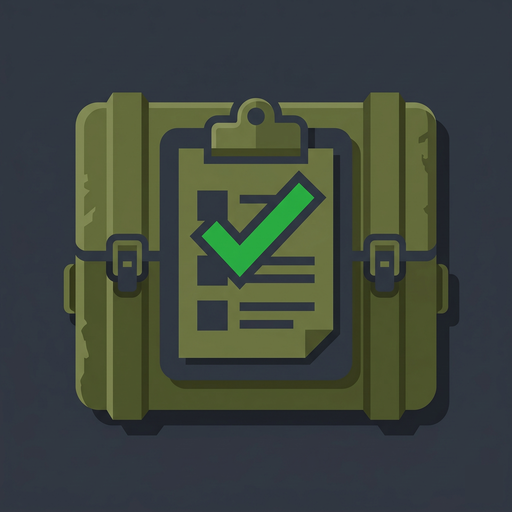
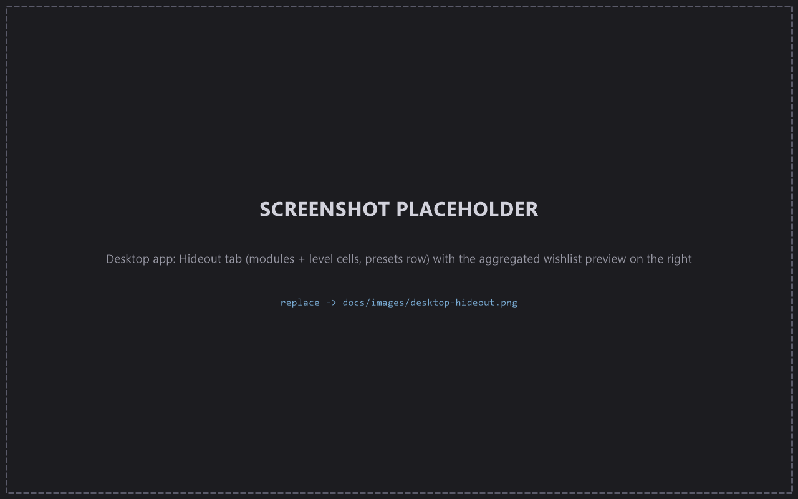
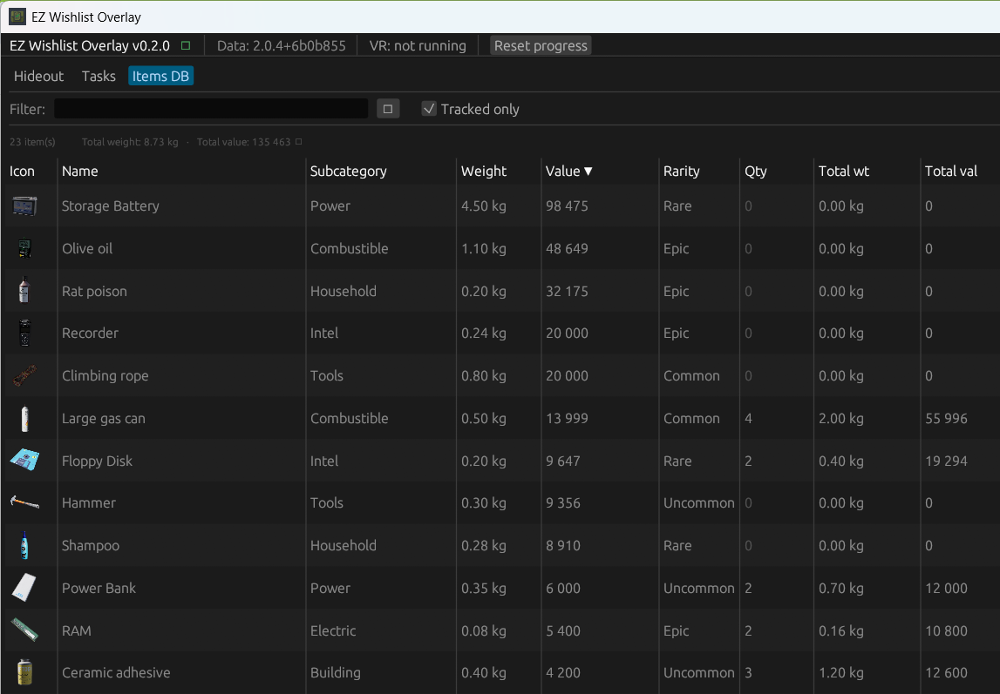
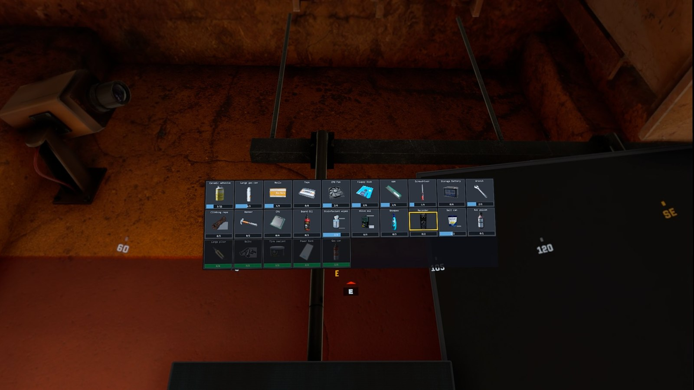
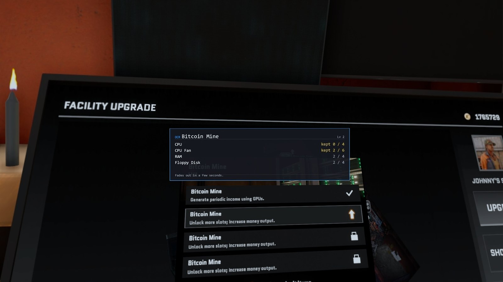
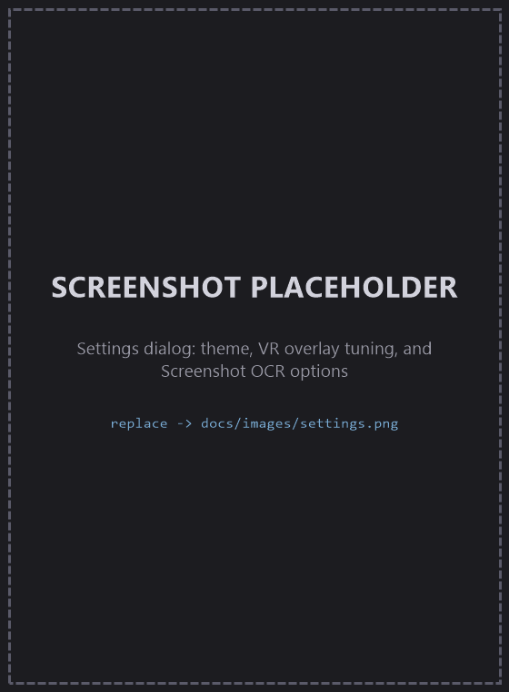

  

<h1 align="center">EZ Wishlist Overlay</h1>

  A free desktop + SteamVR companion for <strong>Contractors Showdown: ExfilZone</strong>. 
  Pick the hideout upgrades you're working toward, and it builds one combined 
  shopping list of every item you still need — on your monitor <em>and</em> floating in VR. 
  Peek at an upgrade panel in-game, tap a key, and it reads your progress straight off the screen.

  

  
  
  

> [!NOTE]
> **Anti-cheat-safe by design.** The app never touches the game — no reading its memory, files, or network, no injecting, no hooks. It only talks to SteamVR through the public OpenVR API (the same one OVR Toolkit and XSOverlay use). Even the screenshot feature reads SteamVR's own rendered image, not the game. [More on how this works ↓](#-how-it-stays-anti-cheat-safe)

---

## Why you'd want it

ExfilZone's hideout upgrades each ask for a pile of specific barter items. When you're saving for more than a couple at once, it's hard to remember *what* to pick up and *how many* — so you either over-loot junk or extract without the one thing you needed.

EZ Wishlist Overlay keeps that list for you:

- **Pick your goals** — check off the hideout upgrades you're chasing.
- **Get one combined list** — every required item, de-duplicated and summed across all of them, with a `have / need` count.
- **Check it anywhere** — on your desktop while planning, or floating above you in VR while you loot.
- **Stop counting by hand** — open an upgrade panel in-game, press a key, and the app reads your owned counts off the screen and fills them in.

---

## Features

### 🏠 Track hideout upgrades

The **Hideout** tab lists every facility module, grouped the way the in-game Facility Upgrade screen groups them (Kitchen, Medical, Storage Zone, Lounge…), with a cell per upgrade level. Tick **Track** on the levels you're saving for, or **Done** on ones you've finished. One-click **presets** — a community *Starter* set and a *Natural progression* set, each with a "how many you already have" counter — track a whole recommended batch at once, and *Deselect all* clears your tracking in one go. Flip to the **By progress** view for a ranked to-do list: upgrades you can claim right now rise to the top, ones you're only an item or two short of sit right below, and you can **Pin** the goals you care about most to keep them first.

  

### 🧾 One combined wishlist

The preview pane on the right is the heart of it: every item across all the upgrades you're tracking, summed together, shown as `collected / needed` with a progress bar and the list of upgrades asking for it. Nudge counts up and down with the `+ / −` buttons, or type an exact number to seed it from what's already in your stash. Pinned upgrades push their items to the front here and in the headset, and a **Sort** switch can reorder this desktop list by what's most remaining or most valuable — the VR overlay keeps its own steady order so it never reshuffles mid-raid.

### 🗃️ Track items across your containers

Your barter items aren't all in one place — some sit in your main stash, others in item cases, on hideout shelves, or in a backpack. The **Containers** tab lets you model that. Your **stash** is pinned at the top as primary storage, and below it you can add secondary containers grouped by type — **Cases**, **Shelves**, and **Bags** — each with a name and an icon. Every container's contents count toward your owned totals exactly like the stash, so stashing three bolts in a case and four in your stash still flips an upgrade that needs seven to *ready*.

For containers that have an in-game contents screen — the **Cases** — you don't have to type it all in. Hit **Scan from screen**, open the case in-game, and press **SPACE** at each scroll position: the app reads each screenful of items and merges the overlapping shots into one list. A centered window shows the running tally live, and **Finish & review** opens a before/after diff (new, changed, and removed items) — alongside the rows it actually read, so you can drop any that look wrong — before you commit. Applying a scan **replaces** that container's contents with what was read — the review step spells that out up front.

<!-- TODO: add docs/images/desktop-containers.png — a real-data capture of the Containers tab showing the Primary storage / Cases / Shelves / Bags sections — then reference it here like the other feature sections. -->

### 📦 Items database & stash value

The **Items DB** tab is a sortable, filterable catalog of the barter items hideout upgrades ask for. Because the *quantity* column is the same count the rest of the app tracks, sorting by **Total Value** turns it into a quick "what's my stash actually worth" view. Flip on **tracked only** to narrow it to items you currently need.

  

### 🥽 Glance at your list in VR

Put the headset on and **look up** — the wishlist fades in above you as a SteamVR overlay. It anchors in world space at the spot you raised your gaze to, so you can look back down to read and interact with it without it chasing your eyes. Items grey out as you complete them, and the panel re-renders the instant anything changes on the desktop side.

  

### 👆 Tick items off without taking the headset off

Point a controller at an item in the overlay and pull the trigger to bump its collected count (+1 per click, wrapping back to 0 once you hit the target so you can fix an overshoot). A short haptic pulse confirms each tap.

### 📸 Read your progress off the screen — one keypress

This is the time-saver. Open an upgrade's **Facility Upgrade** panel in-game, and with the desktop window focused press **SPACE**. The app captures what SteamVR is showing, recognizes which upgrade panel it is, reads the owned-count for every required item, and writes those numbers straight into your wishlist — no manual counting. A card pops up in the headset showing exactly what changed. By default it also auto-tracks that upgrade and marks the lower levels done.

  

> It reads SteamVR's *rendered image* — the same pixels already on your headset display — through OpenVR's public mirror-texture API. It never looks at the game process. See [below](#-how-it-stays-anti-cheat-safe).

### ⚙️ Tune it to your setup

A **Settings** dialog covers the things worth adjusting: Dark / Light / System theme, the VR overlay's size and how far up you have to look before it appears, the OCR options (capture eye, how long the feedback card lingers, auto-track on/off), and an "open data folder" shortcut. Sensible defaults mean you can ignore all of it if you'd rather.

  

### …and a few niceties

- **Works offline.** All game data is baked into the app — no servers, no accounts. The only network call is an optional once-per-launch update check, which you can turn off.
- **Tells you when there's an update.** A quiet banner appears when a newer release is out, with a download link; dismiss it and it won't nag until the *next* version.
- **Help fix the data.** If an upgrade's recipe is wrong, edit it locally and hit **Export corrections** to get a ready-to-paste GitHub issue so the fix can ship to everyone.

---

## Install

1. **Install SteamVR.** It's what the overlay talks to. Get [Steam](https://store.steampowered.com/), then in the Steam client go to *Library → Tools → SteamVR → Install*. (The desktop app runs fine without it — you just won't get the VR overlay or screenshot reading.)
2. **Download the latest release** from the [**Releases page**](https://github.com/etiennechabert/ez-wishlist-overlay/releases/latest). Grab the installer (**`…-installer.msi`**), or the portable build (**`…-portable.exe`**) if you'd rather not install anything — just double-click it.
3. **Click past the SmartScreen warning.** The build isn't code-signed yet, so Windows shows *"Windows protected your PC."* Click **More info → Run anyway**. (This goes away once there's a signing cert — for now the warning is expected, not a virus.)
4. **Run it.** The app opens. Start SteamVR (or put your headset on) and the header flips from *"VR: not running"* to *"VR: connected"* within a few seconds.
5. **In the headset:** look up to bring the overlay in, point a controller at an item and click to bump its count, and press **SPACE** (with the desktop window focused) while an upgrade panel is open to auto-read your progress.

Your tracked upgrades, collected counts, and settings live in `%APPDATA%\etienneb\ez-wishlist-overlay\`. Uninstalling leaves that folder in place; delete it by hand for a clean slate.

---

## 🔒 How it stays anti-cheat-safe

The app is built to never give an anti-cheat any reason to flag it. It runs entirely as its own separate program and **does not**:

- open a handle to the game, or read/write its memory
- inject into the game or hook any of its DLLs or syscalls
- read or modify game files
- capture or inspect game network traffic

All it does is talk to **SteamVR** over the public **OpenVR API** — the same supported interface used by overlay apps like OVR Toolkit and XSOverlay. It renders its overlay there and reads the HMD's orientation to know when you're looking up.

The screenshot/OCR feature works the same way: it asks SteamVR for its **compositor mirror texture** — the image SteamVR has *already rendered and is showing on your headset* — and reads that. The game process is never touched; the app only ever sees pixels SteamVR chose to display.

---

## Credits & data

Hideout and item data come from [**ExfilZone Assistant**](https://www.exfil-zone-assistant.app/) by [pogapwnz](https://ko-fi.com/J3J41GATK0), used under the MIT license (bundled at [`LICENSES/exfil-zone-assistant-MIT.txt`](./LICENSES/exfil-zone-assistant-MIT.txt)). It's an excellent companion that covers far more than the hideout data we use — combat simulators, weapon databases, quest guides, maps, and more — so if this app is useful to you, go check theirs out too.

Game content © Caveman Studio. EZ Wishlist Overlay is an unofficial, fan-made tool and isn't affiliated with or endorsed by Caveman Studio.

This project is open source under the [MIT license](./LICENSE).

---

Building from source, refreshing game data, or cutting a release? See [**docs/DEVELOPMENT.md**](./docs/DEVELOPMENT.md). The original engineering spec lives in [SPEC.md](./SPEC.md).
